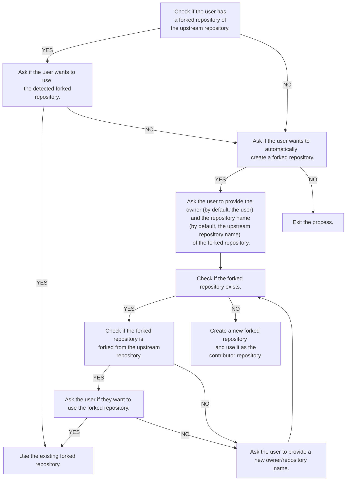

# Git Repository Handling in FOSScope Toolkit.

This document describes how the FOSScope Toolkit handles Git repositories.

## Introduction

FOSScope contributors will need to interact with Git repositories in various ways. Normally, they would have to fork
the repository under FOSScope organization to their own account (or organization) and then clone the forked repository.

They would then have to create a new branch for their work, make changes, commit them, push the changes to their forked
repository, and then create a pull request to the original repository.

FOSScope Toolkit targets to automate this process. It provides a set of commands to handle Git repositories in a more
convenient way.

## Repository Forking

This part describes how FOSScope Toolkit automates the fork process and how it make sure that the repository is the
correct one.

In the core component of the toolkit, as we want to make it more flexible, we don't hardcode the repository URL. Instead,
the library takes both the owner and the repository name of both the upstream repository and the forked repository as
arguments. The core component also have the following abilities:

- Check if the forked repository exists.
- Check if the forked repository is forked from the upstream repository.
- Create a forked repository if it doesn't exist.
- If the current authenticated owns a fork of the upstream repository.

The toolkit clients (CLI and Tauri backend) will use the core component to handle the repository forking process, which
would behave as follows:

> [!NOTE]
> 
> The toolkit clients will have the FOSScope organization and the repository name hardcoded.

